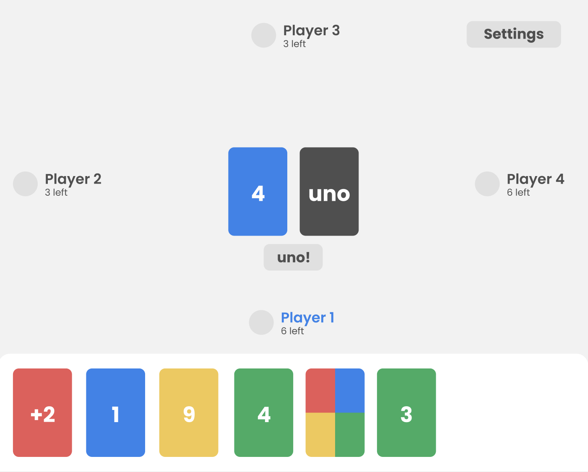
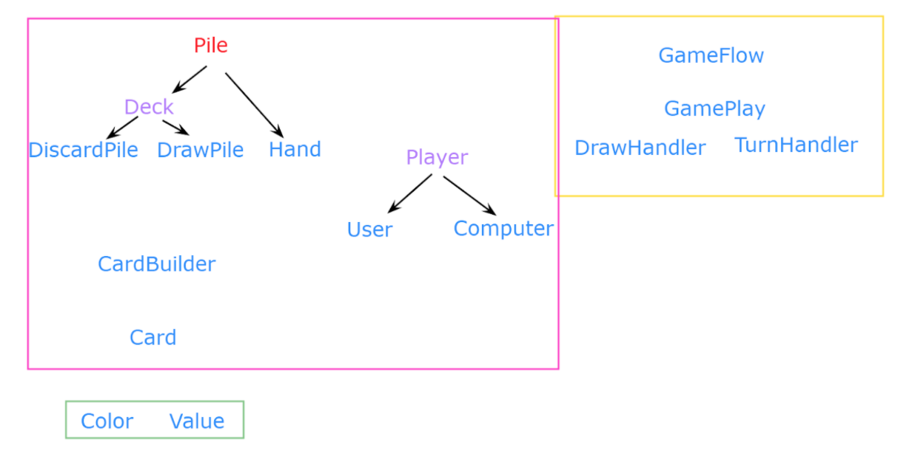
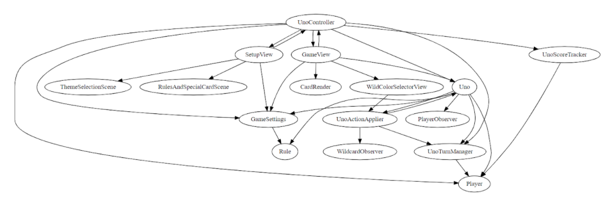

# The Ninth Planet Final: Moono

* Selena Qian (sq22)
* Mary Jiang (mvj6)
* Tess Noonan (tcn6) 
* Suomo Ammah (sna19)

---

# Functionality

---

# Data Files
* Internal (essential)
    * Properties files
* External (user created)
    * XML
    * Stylesheets
    
---

# Tests
* HandTest
* XMLToJavaTest
* ThemeSelectionThemeTest

---

# Design

---

# Initial Design Goals

* Flexibility for a variety of Uno-based games, with customizable themes
    * Implementing new rules and special cards should not affect rest of code

---

# APIs (Pile and Game)
* Show public methods
* Supports new features
* Support teammates
* Evolution over sprints

---

# Use cases

---

# Pile: Dealing Cards

    !java
     /**
     * --> This is from the Uno class
     * Deal cards to all players in the beginning of a game
     */
     private void dealCards(){
        for(int i = 0; i < mySettings.getNumPlayers(); i ++){
             Player player = turnManager.getAllPlayers().get(i);
             for (int j = 0; j < mySettings.getHandSize(); j++){
                 Card card = piles.drawCard();
                 player.hand().addCard(card);
             }
        }
     }

---
# GameModel: Playing a Card

    !java
    /**
       * --> From the UnoController class
       * Called when a user selects a card from their hand
       * @param card card that was clicked in the view
       */
      public void handleCardClick(Card card){
          if(turnManager.isHumanTurn()){
              if(uno.playCard(card, turnManager.getCurrentPlayer())) {
                  try {
                      Thread.sleep(2000);
                  }
                  catch (Exception e) {
                      throw new OOGAException(myResources.getString("NoSuch"),e);
                  }
              }
          }
      }

---

    !java
    /**
    * --> From the Uno class (implements GameModel)
    */
 
    @Override
      public boolean playCard(Card selectedCard, Player player){
          //check if played card can be played on top of the discard pile top card
          if (rule.isValid(piles.showTopCard(), selectedCard)) {
  
              //make sure player updates their hand to remove the card
              player.hand().removeCard(selectedCard);
  
              //update the discard pile to add the card
              piles.discardCard(selectedCard);
  
              //apply associated action
              actionApplier.applyAction(selectedCard.getValue());
              endTurn();
          }
          return false;
      }

---
  
# Changed Design Element

Connecting the model and view with observers vs. JavaFX property binding
    
    !java
    public interface PlayerObserver {
      void updatePlayerHand(int playerId, List<Card> cardsLeft);
      void updateDiscardPile(Card card);
  }
  
---

# Team

---

# Initial Plan vs. Implementation

---

# Planned Modules

---

# Implementation

* Each learned from Agile/Scrum process

---

# Timeline
* Translating APIs to coding reality
* Special cards
* Player module
* Connecting components to View
* Each learned from managing a large project

---

# Team Culture

* What we actively worked to improve
    * Communication - more meetings in last sprint
    * Commenting code
    * Making integration easier
* What we could still improve
    * Dependencies
    * Even more data-driven
* Each learned about creating a positive team culture

---

# Team Contract:
* What was useful
* What could be updated

> "We will expect each other to work consistently on our project, and front-load our work to the beginning of each sprint. Communication is key. We will create a [task-tracking system](https://docs.google.com/spreadsheets/d/11FaTKxmpqZN-wYOsoiqJvDP3LmAJSurGGHqMblpMS40/edit?usp=sharing), update one another in the group chat, and schedule regular video call meetings. We will use the group chat to schedule meetings, but discuss code “in person.” Everyone will be present at and contribute to every meeting. This is a team project and we should all ask each other for help when applicable. We should all stay up to date with class material/lectures. Our video meetings will start with a Stand Up meeting: what have you done, what are you working on, what do you need help with. We should all comment on our code as we go so other team members can interpret it. Have fun! XP"

* Each learned about communication and solving problems

---

# Thanks!